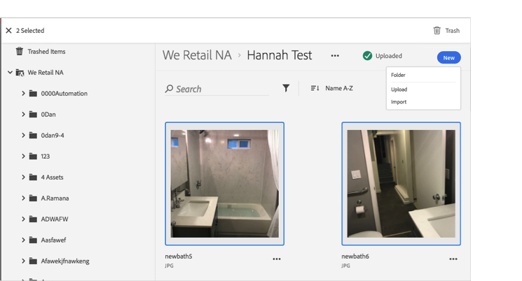

# Corbeille d'un fichier{#trash-an-asset}

Vous pouvez corbeille un fichier dans la bibliothèque Adobe Experience Cloud pour le supprimer de la bibliothèque.

Pour corbeille un fichier dans la bibliothèque Experience Cloud :

1. Cliquez sur un ou plusieurs fichiers à corbeille. 

1. Cliquez sur l'icône **[!UICONTROL Corbeille]** en haut de la page.

