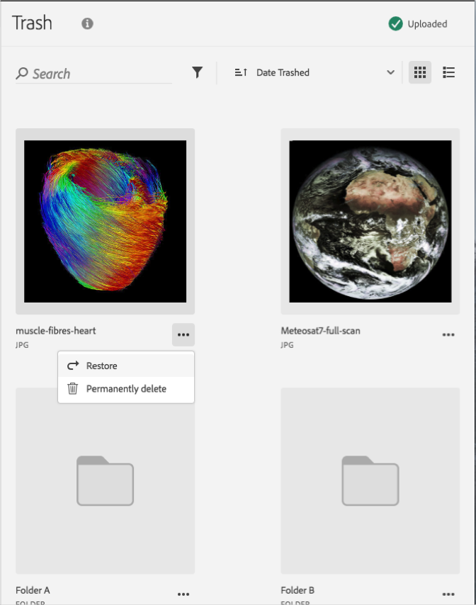

# Suppression définitive d’une ressource mise à la corbeille{#permanently-delete-a-trashed-asset}

Vous pouvez supprimer définitivement une ressource mise à la corbeille dans la bibliothèque Adobe Experience Cloud.

Lorsque vous placez une ressource dans la corbeille d’Experience Cloud, elle y reste pendant 60 jours. Si vous ne restaurez pas les éléments de la corbeille, la bibliothèque Experience Cloud les supprime définitivement après 60 jours.

Vous pouvez supprimer définitivement une ressource mise à la corbeille avant la fin du délai de 60 jours en procédant comme suit :

1. Cliquez sur les **[!UICONTROL éléments mis à la corbeille]**.

   

1. Cliquez sur un ou plusieurs éléments à supprimer définitivement.
1. Cliquez sur **[!UICONTROL Plus d’informations > Supprimer définitivement]**.

   

1. Confirmez que vous souhaitez supprimer définitivement les ressources sélectionnées.

