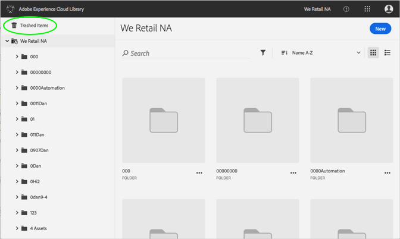
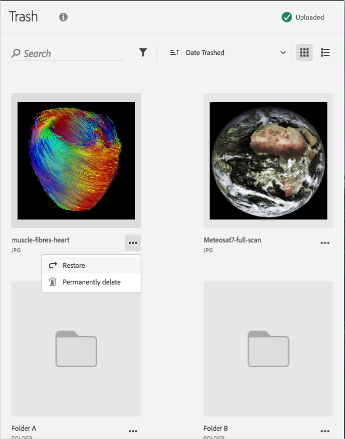

# Restauration d’une ressource mise à la corbeille{#restore-a-trashed-asset}

Vous pouvez restaurer une ressource mise à la corbeille dans la bibliothèque Adobe Experience Cloud.

Lorsque vous placez une ressource dans la corbeille d’Experience Cloud, elle y reste pendant 60 jours. Si vous ne restaurez pas les éléments de la corbeille, la bibliothèque Experience Cloud les supprime définitivement après 60 jours.

Pour restaurer une ressource mise à la corbeille avant la fin de délai de 60 jours, procédez comme suit :

1. Cliquez sur les **[!UICONTROL éléments mis à la corbeille]**.

   

1. Cliquez sur un ou plusieurs éléments à restaurer.
1. Cliquez sur **[!UICONTROL Plus d’informations > Restaurer]**.

   

1. Confirmez que vous souhaitez restaurer les ressources sélectionnées.

La confirmation de la ressource restaurée s’affiche en haut.
