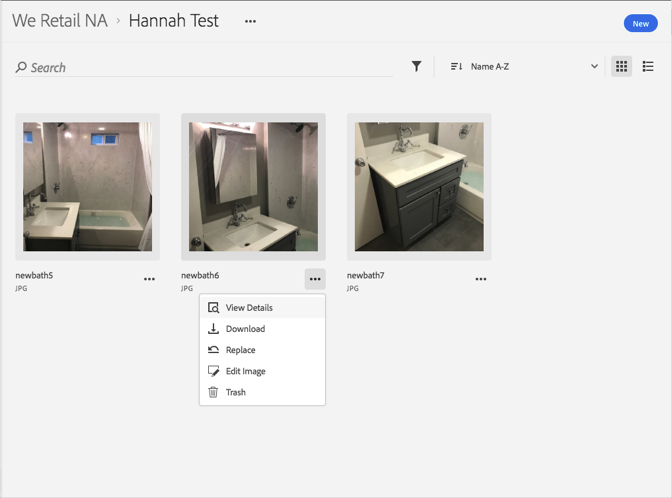
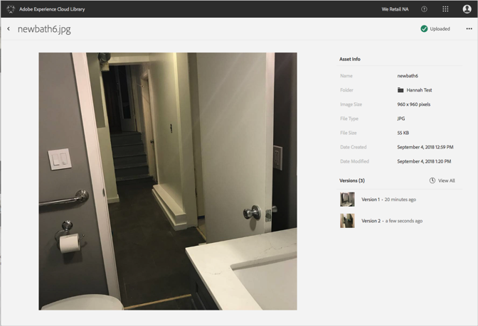

# Restauration d’une ancienne version d’une ressource{#revert-to-an-older-version-of-an-asset}

Vous pouvez revenir à une ancienne version d’une ressource dans la bibliothèque Adobe Experience Cloud.

Pour restaurer une ancienne version d’une ressource dans la bibliothèque Adobe Experience Cloud, procédez comme suit :

1. Cliquez sur une ressource.
1. Cliquez sur le menu **[!UICONTROL Plus d’options]** (ellipse) en regard de la ressource.

   

1. Cliquez sur **[!UICONTROL Détails de la ressource]**.
1. Pour afficher toutes les versions de la ressource, cliquez sur **[!UICONTROL Afficher tout]** en regard de Versions.

   

1. Dans la liste des versions, cliquez sur le menu **[!UICONTROL Plus d’options]** (ellipse) en regard de la version à rétablir.

   

1. Cliquez sur **[!UICONTROL Rétablir]**.

La version que vous avez rétablie devient la version actuelle.
