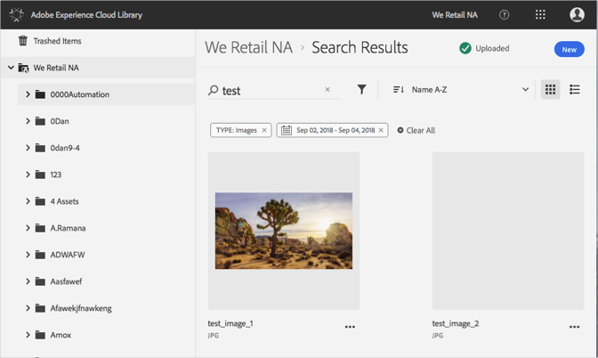

# Recherche de ressources{#search-for-assets}

Recherchez des ressources dans la bibliothèque Adobe Experience Cloud pour rechercher des ressources à l’échelle de l’organisation ou dans un dossier spécifique.

Recherchez des ressources dans la bibliothèque Experience Cloud à l’aide de la barre de recherche. La recherche recherche les noms de fichier.

