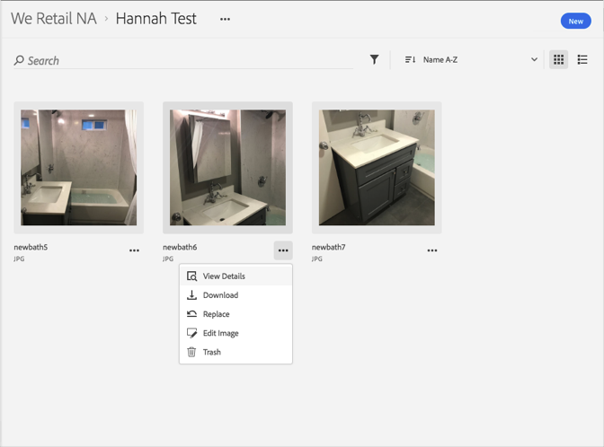

# Afficher les versions précédentes d'un fichier{#view-previous-versions-of-an-asset}

Vous pouvez afficher les versions précédentes d'un fichier dans la bibliothèque Adobe Experience Cloud.

Pour afficher les versions précédentes d'un fichier dans la bibliothèque Experience Cloud :

1. Sélectionnez un fichier.
1. Sélectionnez le **[!UICONTROL menu Plus d'options]** (points de suspension) en regard du fichier.

   

1. Sélectionnez **[!UICONTROL Détails de la ressource]**.
1. Sélectionnez **[!UICONTROL Afficher tout]** en regard de Versions pour afficher toutes les versions du fichier.

   

