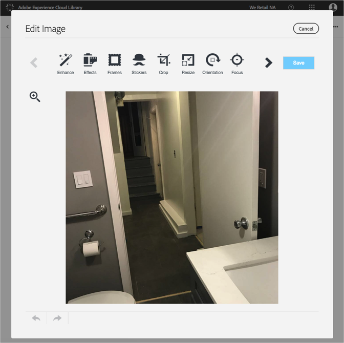

# Modification d’une image{#edit-an-image}

À l’aide de l’éditeur d’image de base intégré à la bibliothèque Adobe Experience Cloud, modifiez une image directement dans la bibliothèque.

Pour modifier une image de la bibliothèque Experience Cloud, procédez comme suit :

1. Cliquez sur une image à modifier.
1. Cliquez sur Modifier l’image. Lorsque vous enregistrez l’image, elle est enregistrée comme une nouvelle version.

   Dans l’éditeur d’image qui s’ouvre, vous pouvez modifier l’image.

   

