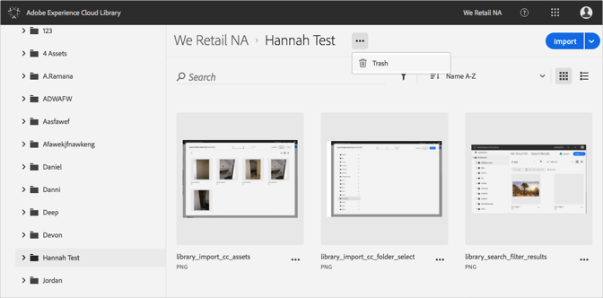
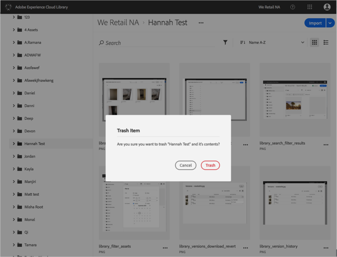

# Mise à la corbeille d’un dossier{#trash-a-folder}

Dans la bibliothèque Adobe Experience Cloud, vous pouvez mettre un dossier à la corbeille.

Pour mettre à la corbeille un dossier dans la bibliothèque Experience Cloud, procédez comme suit :

1. Cliquez sur le dossier à mettre à la corbeille.
1. Cliquez sur le menu **[!UICONTROL Plus d’options]** (ellipse) et sélectionnez **[!UICONTROL Corbeille]**.

   

1. Confirmez que vous souhaitez mettre le dossier à la corbeille.

   

