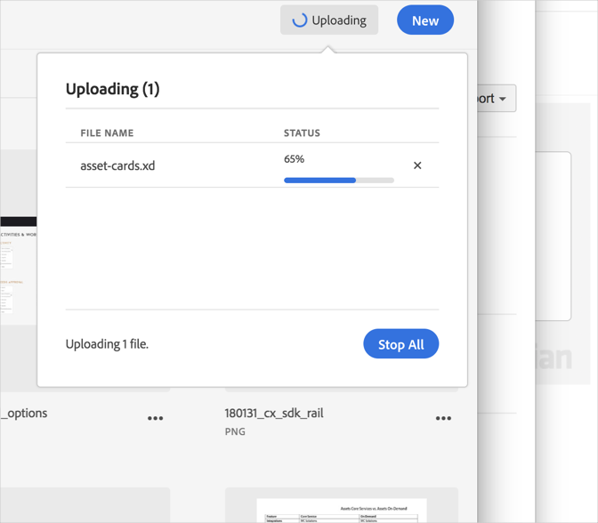

# Annulation d’un transfert{#cancel-an-upload}

Annulez un transfert de votre appareil vers la bibliothèque Adobe Experience Cloud si vous avez sélectionné un fichier incorrect ou trop volumineux.

Pour annuler un transfert qui a déjà commencé, procédez comme suit :

1. Cliquez sur l’indicateur de notification.
1. Cliquez sur **[!UICONTROL Tout arrêter]** pour arrêter tous les téléchargements ou sur la croix (**[!UICONTROL X]**) en regard de chaque fichier à annuler.

   

Si vous sélectionnez un ou plusieurs fichiers portant le même nom, la bibliothèque Experience Cloud vous invite à remplacer les anciennes versions ou à conserver les nouvelles versions.
