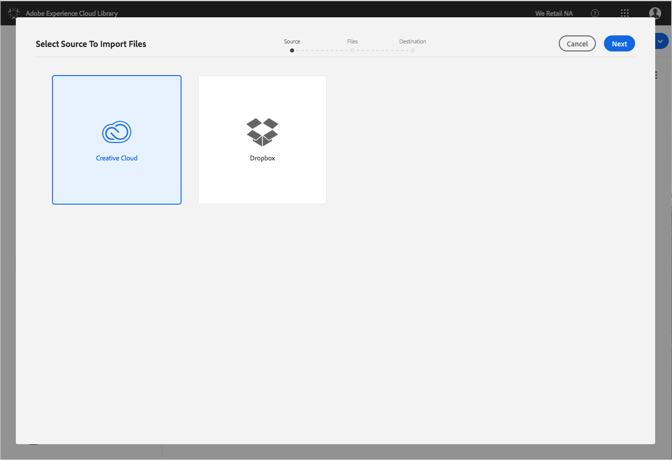
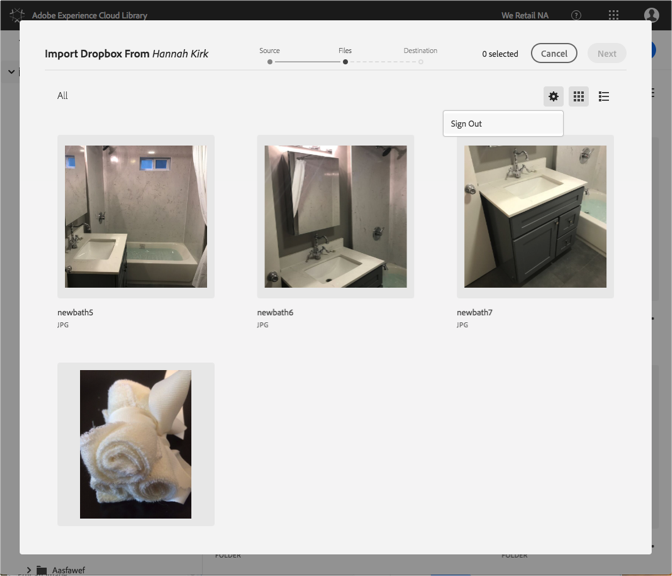

# Modification des comptes Dropbox ou Creative Cloud{#change-dropbox-or-creative-cloud-accounts}

Passez à un autre compte Dropbox ou Creative Cloud pour ajouter du contenu à la bibliothèque Adobe Experience Cloud.

Lorsque vous vous connectez à un compte Dropbox ou Creative Cloud, vous restez connecté, sauf si vous déconnectez ou changez de compte.

Pour passer à un autre compte Dropbox ou Creative Cloud :

1. Sélectionnez **[!UICONTROL Nouveau]** &gt; **[!UICONTROL Importer]**.

   

1. Sélectionnez **[!UICONTROL Creative Cloud]** ou **[!UICONTROL Dropbox]**.

   

1. Sélectionnez **[!UICONTROL Suivant]**.
1. Sélectionnez l'icône d'engrenage dans le coin supérieur droit.

   

1. Sélectionnez **[!UICONTROL Déconnexion]**.
1. Connectez-vous à l'autre compte.

