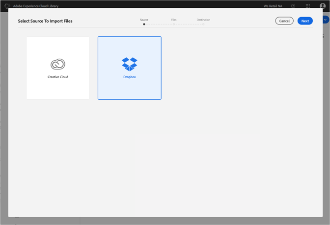
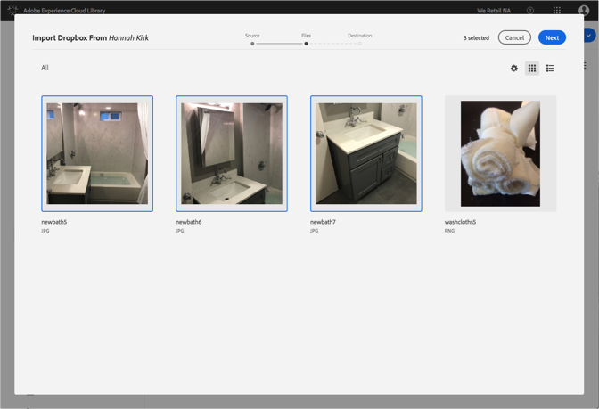
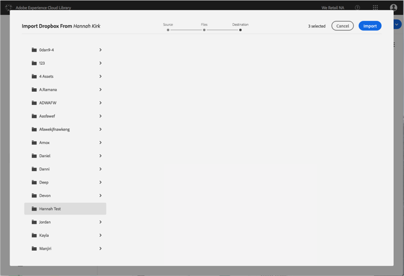

# Importation de fichiers Dropbox dans la bibliothèque Adobe Experience Cloud{#import-dropbox-files-into-the-adobe-experience-cloud-library}

Importez des fichiers depuis Dropbox vers la bibliothèque Adobe Experience Cloud afin de les gérer depuis n’importe quel produit Adobe Experience Cloud.

>[!NOTE]
>
>Avant de pouvoir effectuer cette tâche, vous devez créer un dossier.

Pour importer des fichiers Dropbox dans la bibliothèque Experience Cloud, procédez comme suit :

1. Select **[!UICONTROL New]** > **[!UICONTROL Import]**.

   

1. Sélectionnez **[!UICONTROL Dropbox]**.

   Connectez-vous à votre compte Dropbox, le cas échéant.

   

1. Cliquez sur **[!UICONTROL Suivant]**.
1. Sélectionnez un ou plusieurs fichiers à importer.

   

1. Cliquez sur **[!UICONTROL Suivant]**.
1. Sélectionnez le dossier dans lequel placer les ressources.

   >[!NOTE]
   >
   >Vous pouvez choisir un dossier dans lequel importer les ressources. Pour placer des fichiers dans différents dossiers, répétez cette tâche pour chaque dossier.

   

1. Cliquez sur **[!UICONTROL Importer]**.

