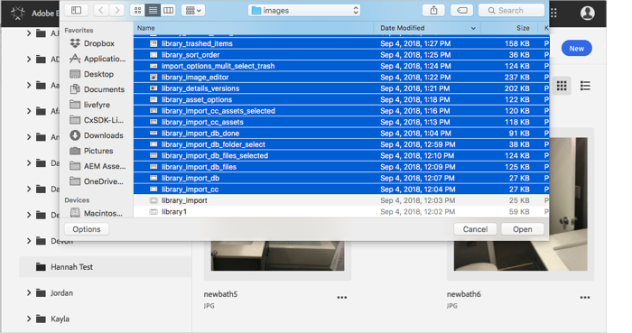
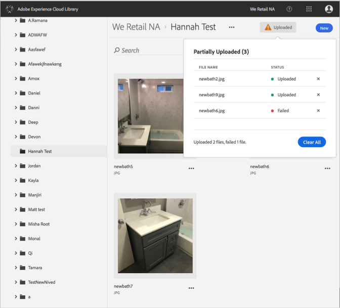

# Transfert d’une ressource d’un appareil{#upload-asset-from-device}

Transférez des ressources de votre appareil pour les gérer dans la bibliothèque Adobe Experience Cloud.

Pour transférer des ressources de votre appareil vers la bibliothèque Experience Cloud, procédez comme suit :

1. Sélectionnez **[!UICONTROL Nouveau]** > **[!UICONTROL Télécharger]**.

   

1. Sélectionnez les ressources à transférer vers la bibliothèque Experience Cloud.

   

1. Une fois le transfert des fichiers terminé, une confirmation ou un message d’erreur s’affiche dans la zone de notification.

   

